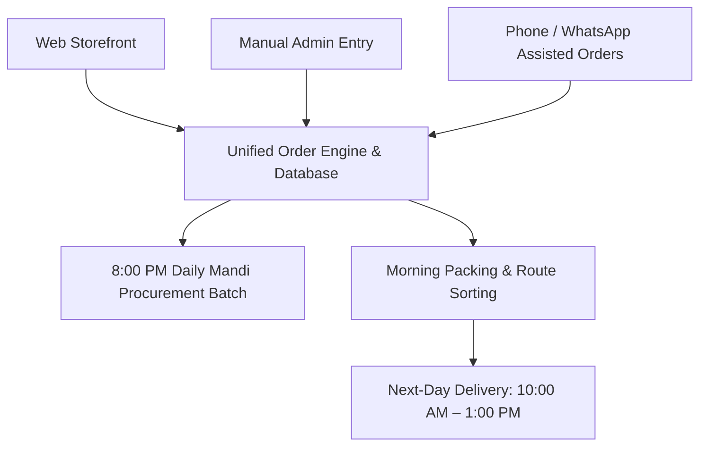
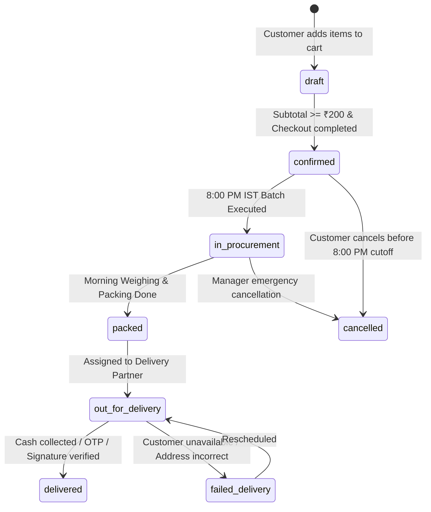

# Taji Tokri – Production Business Rules & Operational Specifications

**Document Version:** 1.0.0  
**Status:** Approved Architecture Baseline  
**Timezone Reference:** `Asia/Kolkata` (IST, UTC+05:30)  
**Currency:** Indian Rupee (INR - ₹)

---

## 1. Overview & Multi-Channel Ingestion Model

Taji Tokri operates a direct farm/mandi-to-doorstep fresh vegetable supply chain. All customer touchpoints feed into a **single, unified database**:



### Ingestion Rules
1. **Single Source of Truth:** Web storefront, phone-assisted orders, and manual back-office orders share the identical database schema, validation rules, and pricing engines.
2. **Channel Tracking:** Every order record must explicitly record its origin channel:
   - `web` (Customer placed via web application)
   - `manual_admin` (Admin/Manager counter order)
   - `phone_whatsapp` (Customer support / Phone assisted entry)

---

## 2. Customer Identity, Authentication & Profile Rules

### 2.1 Authentication & Registration
- **Passwordless Phone OTP:** Customer authentication is strictly mobile phone OTP based (no passwords).
- **First-Time Customers:**
  - On first sign-in, the customer must provide:
    1. Full Name
    2. Primary Mobile Number (verified via OTP)
    3. Delivery Address (House/Flat/Block, Apartment/Society/Street, Landmark, Area, Pincode)
    4. Optional alternate contact number
- **Returning Customers:**
  - Auto-recognized by verified phone number.
  - Automatically loads saved profile and default delivery address.
  - No re-entry of basic information required; one-click checkout enabled.

### 2.2 Address Management
- **Multiple Addresses Support:** Customers can store multiple addresses categorized by type:
  - `home` (Permanent / Residence)
  - `work` (Office / Commercial)
  - `temporary` (Other / Guest location)
- **Address Attributes:**
  - Exact address fields with mandatory Landmark and Pincode.
  - Coordinates / Geolocation (Latitude & Longitude) stored when available.
  - `is_default` flag to designate the primary delivery destination.

---

## 3. Pricing, Catalog & Localization Rules

### 3.1 Bilingual Product Catalog
- Every catalog product must contain both Gujarati and English nomenclature:
  - `name_en` (e.g., *Okra / Lady Finger*, *Potato*, *Coriander*, *Ginger*)
  - `name_gu` (e.g., *ભીંડા*, *બટાટા*, *કોથમીર*, *આદુ*)
- Local unit of measurement standard: `kg`, `500g`, `250g`, `100g`, `bunch` (પૂંજી/જુડી), `piece` (નંગ).

### 3.2 Dual-Tier Pricing Structure
- **Supplier Cost Price (`supplier_cost_price`):**
  - The estimated/actual procurement rate from Mandi/Farmer.
  - **Strictly Confidential:** Hidden from public customer APIs, frontend code, packing staff, and delivery personnel.
  - Accessible only to `owner` and `manager` roles for gross margin calculations.
- **Selling Price (`selling_price`):**
  - Public retail price displayed on the storefront.
  - Can change on a **daily basis** based on morning market arrivals.

### 3.3 Historical Price Immutability
- **Golden Rule:** When an order is placed and confirmed, the item prices must be **permanently locked**.
- Daily selling price fluctuations or future catalog updates must **NEVER** alter historical order line items.
- Line items (`order_items`) must store immutable point-in-time snapshots:
  - `unit_price_at_order`
  - `cost_price_at_order`
  - `discount_applied_per_unit`
  - `total_item_price`

---

## 4. Ordering Thresholds & Discount Hierarchy

### 4.1 Minimum Order Threshold
- **Rule:** Cart subtotal must be **>= ₹200 before any discounts** or delivery fees.
- If Subtotal < ₹200, checkout is blocked across all channels (`web`, `manual_admin`, `phone_whatsapp`).

### 4.2 Discount Structures

| Discount Type | Criterion / Eligibility | Value |
| :--- | :--- | :--- |
| **First 500 Verified Customers** | First successful order for the first 500 verified phone numbers in the system | **10% OFF** on eligible subtotal |
| **Cash on Delivery (COD)** | Payment method selected is COD at confirmation | **2% OFF** on payable order total |
| **Online Payment (Prepaid)** | UPI / Cards / Net Banking | **0%** (Standard price, no surcharge/discount) |

### 4.3 Discount Calculation Pipeline & Stacking Order

The order calculation must execute in a strict deterministic sequence:

$$\text{Subtotal} = \sum (\text{Item Quantity} \times \text{Unit Selling Price})$$

$$\text{Validation: } \text{Subtotal} \ge ₹200.00$$

$$\text{Step 1: First-Time Promo Discount} = \begin{cases} 0.10 \times \text{Subtotal}, & \text{if Customer is in First 500 Verified \& First Order} \\ 0.00, & \text{otherwise} \end{cases}$$

$$\text{Base Discounted Total} = \text{Subtotal} - \text{First-Time Promo Discount}$$

$$\text{Step 2: Payment Method Discount} = \begin{cases} 0.02 \times \text{Base Discounted Total}, & \text{if Payment Method is COD} \\ 0.00, & \text{if Payment Method is Online} \end{cases}$$

$$\text{Final Payable Amount} = \text{Base Discounted Total} - \text{Payment Method Discount} + \text{Delivery Fee (if any)}$$

*Note: All currency amounts round to 2 decimal places using standard half-up rounding.*

---

## 5. Cutoff Times, Fulfillment & Delivery Scheduling

### 5.1 The 8:00 PM IST Cutoff Rule
All delivery date assignments are calculated strictly against `Asia/Kolkata` time:

```mermaid
gantt
    title Order Placement to Fulfillment Pipeline (Asia/Kolkata)
    dateFormat HH:mm
    axisFormat %H:%M

    section Pre-8 PM Orders (Day T)
    Order Placed (< 20:00)         :done, ord1, 08:00, 20:00
    8 PM Batch & Procurement        :crit, proc1, 20:00, 21:00
    Night Mandi Procurement (T)    :active, mand1, 22:00, 04:00
    Morning Sorting & Packing (T+1):pack1, 05:00, 09:30
    Delivery Slot (10 AM - 1 PM)   :crit, del1, 10:00, 13:00

    section Post-8 PM Orders (Day T)
    Order Placed (>= 20:00)        :ord2, 20:00, 23:59
    Batch Assignment (Day T+1 8PM) :proc2, 20:00, 21:00
    Delivery Slot (Day T+2)        :crit, del2, 10:00, 13:00
```

- **Order Confirmed `< 20:00:00 IST` on Day $T$:**
  - Scheduled Delivery Date: **Day $T + 1$ (Next Day)**
  - Delivery Time Window: **10:00 AM – 1:00 PM IST**
- **Order Confirmed `>= 20:00:00 IST` on Day $T$:**
  - Scheduled Delivery Date: **Day $T + 2$ (Next-to-Next Day)**
  - Delivery Time Window: **10:00 AM – 1:00 PM IST**

### 5.2 Daily 8:00 PM Procurement Batching & Reporting
- At **20:00:00 IST daily**, the system generates the consolidated **Mandi Procurement Report**:
  - Aggregates all confirmed orders scheduled for delivery on Day $T+1$.
  - Totals exact quantities required per vegetable in procurement units (kg, bunches, crates).
  - Generates individual crate/parcel packing manifests for warehouse staff.
- Once the 8:00 PM batch executes, next-day orders are frozen for procurement.

---

## 6. Role-Based Access Control (RBAC) Matrix

| Resource / Action | Owner | Manager | Packing Staff | Delivery Partner | Customer |
| :--- | :---: | :---: | :---: | :---: | :---: |
| **View Public Catalog & Prices** | ✅ | ✅ | ✅ | ✅ | ✅ |
| **Manage Own Profile & Addresses** | ✅ | ✅ | ❌ | ❌ | ✅ (Self only) |
| **Place Orders (Web)** | ✅ | ✅ | ❌ | ❌ | ✅ (Self only) |
| **Place Manual / Phone Orders** | ✅ | ✅ | ❌ | ❌ | ❌ |
| **Update Daily Selling Prices** | ✅ | ✅ | ❌ | ❌ | ❌ |
| **View/Edit Supplier Cost Prices** | ✅ | ✅ | ❌ | ❌ | ❌ |
| **Generate 8 PM Procurement Sheet** | ✅ | ✅ | ❌ | ❌ | ❌ |
| **View Packing Sheets & Manifests** | ✅ | ✅ | ✅ | ❌ | ❌ |
| **Update Order Status to `packed`** | ✅ | ✅ | ✅ | ❌ | ❌ |
| **View Route / Assigned Deliveries** | ✅ | ✅ | ❌ | ✅ (Assigned only) | ❌ |
| **Collect COD & Mark `delivered`** | ✅ | ✅ | ❌ | ✅ (Assigned only) | ❌ |
| **Modify Business Settings & Discounts** | ✅ | ❌ | ❌ | ❌ | ❌ |
| **View Audit Logs & Financial P&L** | ✅ | ❌ | ❌ | ❌ | ❌ |

---

## 7. Order Lifecycle State Machine



### State Rules:
1. **Cancellation Window:** Customers can self-cancel only while the order status is `confirmed` and current time is before the **8:00 PM IST cutoff** of the placement day.
2. **Post-Procurement Cancellation:** After 8:00 PM (`in_procurement`), orders can only be cancelled by `owner` or `manager` with a mandatory logged reason.

---

## 8. Audit Logging & Compliance Specifications

All structural, financial, and state mutations require an append-only audit trail:

### 8.1 Events Requiring Audit Logging
1. **Price Changes:**
   - Any modification to `selling_price` or `supplier_cost_price`.
   - Records: `product_id`, `old_price`, `new_price`, `changed_by_user_id`, `effective_date`, `timestamp`.
2. **Order Lifecycle Changes:**
   - Any transition in `order_status` or manual edit of order line items/quantities.
   - Records: `order_id`, `old_status`, `new_status`, `actor_id`, `actor_role`, `reason`.
3. **System Settings & Rules:**
   - Updates to minimum order value, cutoff hours, discount rates, or delivery slots.
   - Records: `setting_key`, `previous_value`, `new_value`, `modified_by`.

### 8.2 Audit Immutability Guardrail
- Audit log records are strictly **append-only**.
- Database triggers must reject any `UPDATE` or `DELETE` operations on the `audit_logs` table (`RAISE EXCEPTION 'Audit logs are immutable'`).

---

## 9. Summary Specification Table

| Rule Parameter | Configured Specification |
| :--- | :--- |
| **Minimum Order Value** | ₹200.00 (before discounts) |
| **Cutoff Time** | 20:00:00 Asia/Kolkata (8:00 PM IST) |
| **Standard Delivery Slot** | 10:00 AM – 1:00 PM Asia/Kolkata |
| **Fulfillment Window** | Next-Day (if before 8 PM) / Day+2 (if at or after 8 PM) |
| **COD Discount** | 2% on net payable |
| **Online Payment Discount** | 0% |
| **New Customer Promotion** | 10% on first order for first 500 verified customers |
| **Catalog Languages** | English (`name_en`) + Gujarati (`name_gu`) |
| **Pricing Separation** | Distinct `selling_price` (public) & `supplier_cost_price` (confidential) |
| **Historical Pricing** | Immutable line-item pricing locked at confirmation |
| **Ingestion Engine** | Unified schema for Web, Manual Admin, and Phone/WhatsApp |
| **Audit Requirement** | Immutable append-only logging for prices, orders, settings |
