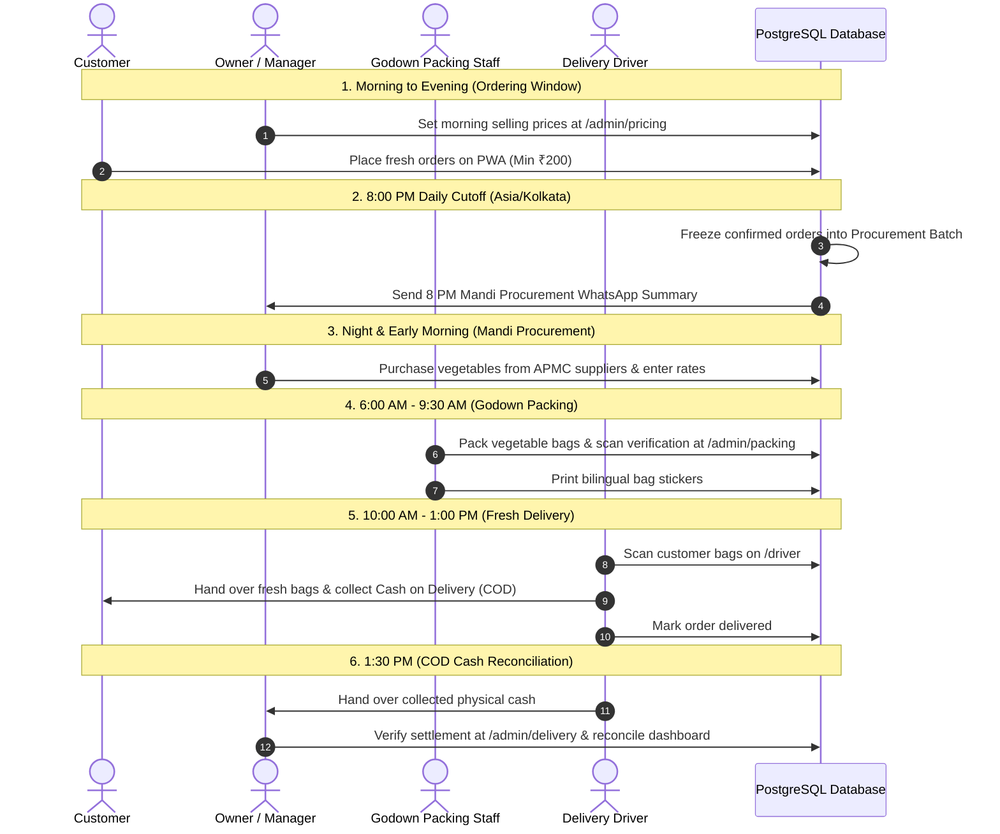

# Sabjiwala Daily Operations Runbook (માલિક અને સ્ટાફ માટે રોજિંદી માર્ગદર્શિકા)

This document describes the daily operational lifecycle of Sabjiwala in Halol, Panchmahal.

---

## 1. Daily Schedule & Responsibilities

| Time (IST) | Role | Operational Action | System Module |
| :--- | :--- | :--- | :--- |
| **05:30 AM - 06:30 AM** | Owner / Manager | Update live daily vegetable selling prices based on APMC morning auction. | `/admin/pricing` |
| **06:30 AM - 08:00 PM** | Customers | Browse catalog, select variants, verify OTP, and place next-day COD orders. | Storefront PWA |
| **08:00 PM Sharp** | Automated System | Authoritative cutoff. Confirmed orders locked into next-day Procurement Batch. | Background Worker / Database |
| **08:05 PM** | Owner | Review 8 PM Mandi purchase summary on WhatsApp & Admin Procurement. | `/admin/procurement` |
| **09:00 PM - 05:30 AM** | Owner / Manager | APMC mandi purchasing. Enter supplier rates, receiving weights, and wastage. | `/admin/procurement` |
| **06:00 AM - 09:30 AM** | Packing Staff | Godown vegetable sorting, multi-bag creation, item checks, and sticker printing. | `/admin/packing` |
| **09:30 AM - 10:00 AM** | Manager / Driver | Assign packed routes to driver runs and dispatch delivery vehicles. | `/admin/delivery` |
| **10:00 AM - 01:00 PM** | Delivery Driver | Doorstep delivery, bag barcode scan, cash collection, and delivered status update. | `/driver` |
| **01:30 PM - 02:00 PM** | Owner & Driver | Physical cash handover, COD discrepancy verification, and final owner audit. | `/admin/delivery` & `/admin/dashboard` |

---

## 2. Standard Operating Procedures (SOPs)

### SOP 1: Phone / WhatsApp Manual Customer Order Entry
When an elderly customer calls or messages support to place an order:
1. Open the Storefront PWA (`https://sabjiwala.store`).
2. Add the requested vegetables to the cart (ensure subtotal $\ge$ ₹200).
3. Enter the customer's mobile number for verification and enter their delivery address in Halol.
4. Review the server quote (FIRST500 + 2% COD discount auto-applied) and confirm the order.
5. The order enters the central database with full snapshots and triggers bilingual WhatsApp confirmation.

### SOP 2: Godown Packing & Sticker Printing
1. Open `/admin/packing` on the Godown packing tablet or desktop.
2. Select an order from the **"Confirmed Orders Waiting for Packing"** queue.
3. Weigh and verify each item in the order checklist.
4. Assign bags (e.g. `Bag 1 of 2: Heavy Vegetables`, `Bag 2 of 2: Leafy & Fragile Greens`).
5. Print bag stickers via thermal printer and stick firmly onto the respective bags.
6. Scan both bags with the USB/Bluetooth barcode scanner to mark the order **"Ready for Delivery"**.

### SOP 3: Driver Delivery & Cash Collection
1. Open `/driver` on the mobile browser.
2. Select the customer delivery on the active run list.
3. At customer doorstep: Scan bag QR/barcodes to confirm correct bags.
4. Collect the exact COD amount displayed on the screen (e.g. ₹308).
5. Tap **"Confirm Delivery"** (triggers immediate WhatsApp Delivered & Bill Summary to customer).

### SOP 4: Driver Cash Settlement & Discrepancy Reconciliation
1. At the end of the delivery shift, driver opens `/driver` and submits the total cash collected (e.g. ₹12,450).
2. Owner opens `/admin/delivery` $\rightarrow$ **"Driver Cash Settlement"**.
3. System compares expected collected cash vs driver handed-over cash.
4. If difference is ₹0: Owner clicks **"Verify & Settle"**.
5. If there is a shortage or excess: System logs the discrepancy, sends an alert to Owner, and requires Owner authorization to resolve.
